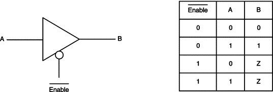
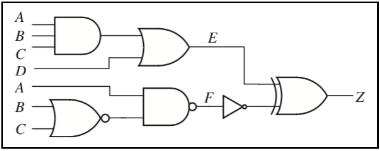
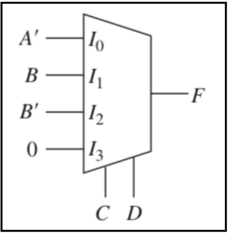
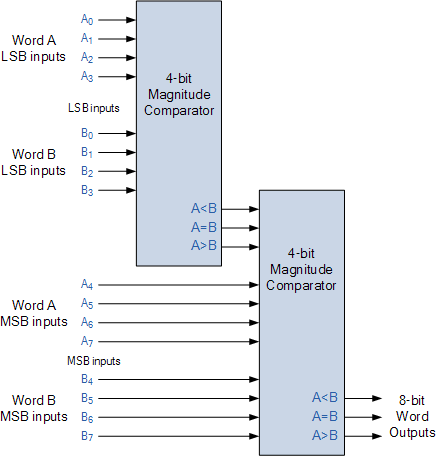

# Verilog Project - combinational circuits

# [Tri-state buffer](https://github.com/yvesemmanuel/verilog_project/blob/master/Q1/buffer.v)

# [Combinational circuit with delay](https://github.com/yvesemmanuel/verilog_project/blob/master/Q2/combinational_delay.v)

# [Conditional circuit](https://github.com/yvesemmanuel/verilog_project/blob/master/Q2/combinational_delay.v)

# [4 & 8 bit comparator](https://github.com/yvesemmanuel/verilog_project/tree/master/Q5)

